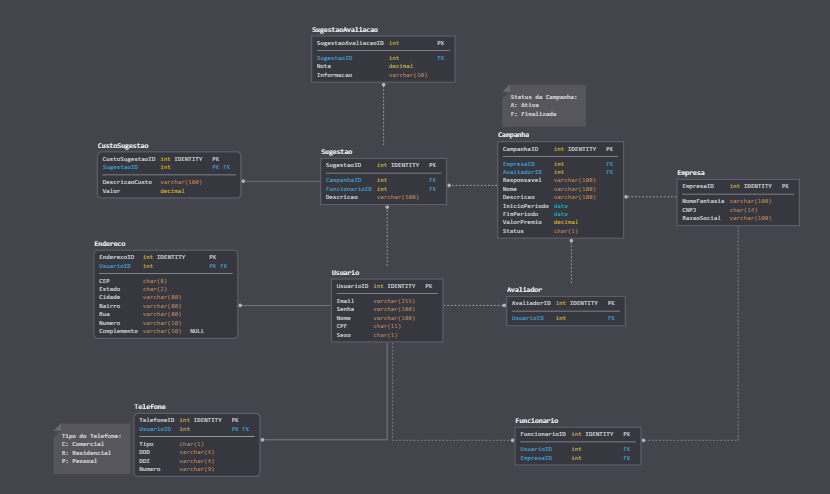

# Minimundo

Este projeto foi criado como um trabalho semestral.
Os professores das disciplinas de **Banco de Dados** e **Desenvolvimento Web** se uniram para formular um TDE.
Em **Banco de Dados**, foi dada uma descrição da aplicação e nós alunos realizamos a modelagem lógica.
Em **Desenvolvimento Web**, foram dados os conceitos e a arquitetura que seriam utilizados na aplicação.

## Utilização

Foram aplicados os conceitos de:

- Orientação à Objetos
- Arquitetura MVC
- DDD

Dependências:

- .NET Core 2.2
- FluentValidation.AspNetCore
- Entity Framework

## Modelo

## Descrição

***Esta é a descrição dada pelo professor de Desenvolvimento Web***

O cliente precisa de um sistema de sugestões. Atualmente, o processo é manual. O
processo atual é o seguinte:

A empresa cria uma campanha (a campanha contém: responsável, nome, descrição,
período e valor do prêmio) de sugestões dentro da empresa com um tema específico, por
exemplo, “Campanha redução conta de luz”. No mesmo momento da criação da
campanha é definido quem (vai ser somente um) é o avaliador das sugestões. O avaliador
é responsável por ler as sugestões e escolher a vencedora.

Hoje no processo manual, a o RH da empresa disponibiliza na intranet um download do
formulário de sugestões que é impresso e preenchido pelos funcionários e devolvido para
o rh da empresa encaminhar para o responsável pela avaliação.

Após o término da campanha o responsável faz uma análise de todas as sugestões e o
elege a vencedora utilizando os seguintes critérios de avaliação: (criatividade,
investimento financeiro, tempo de implantação, redução de custo. Além disso, o RH
divulga o resultado final do ganhador.

O formulário de sugestão é baseado nas seguintes perguntas: Descrição da sugestão,
custos envolvidos.

Dado o contexto anterior desenvolva o DER para em duplas para automatizar o contexto
anterior. Considere que é necessário que você crie um cadastro dos logins para esse
sistema com os campos (login , senha, nome, cpf).

